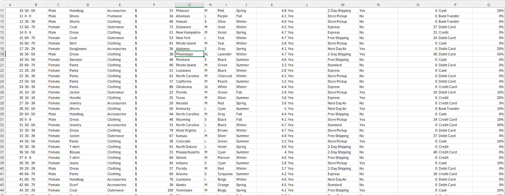
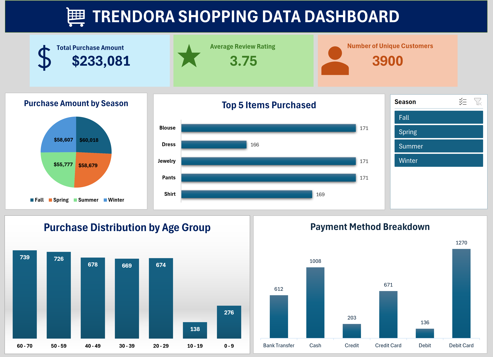

## Trendora Fashion Performance Report (2025)

## Executive Summary
This analysis looks at the performance of Trendora Fashion in 2025. It focuses on the total purchase amount, review rating, products purchased, payment methods, seasonal purchases, and customer age groups.
## Business Context
Trendora Fashion wants to understand how the business is performing, therefore requiring clean data driven analysis. The analysis is used to understand customer purchasing patterns and how well the business us performing across its online and in-store orders.
## Objectives
The report answers the following key questions:
-	What are the main KPIs for the business? 
-	Which items are purchased the most?
-	Which payment method do the customers prefer?
-	Which seasons do the customers spend more?
-	Which age group purchase the most?
## Data Overview
The analysis is based on a dataset of above 3,000 transactions and 17 columns, covering made in 2025. The dataset contains information about customer purchases, product purchased, payment methods, review ratings, age groups and seasons.
## Data Preview

## Dashboard Image

## Data Cleaning and Transformation
-	Removed duplicates from the entire dataset.
-	Null values in the previous purchases column was changed to 0
## Detailed Findings and Analysis
### Key Performance Indicators
-	The total purchase amount exceeded $200,000 in the provided dataset.
-	Seasonal purchases average around $58,000.
-	The brand has an average review rating of 3.75
-	The brad has a total of 3,900 customers
### Purchased Items
-	Blouse, Jewelry and Pants were among the most purchased items, with about 171 units sold.
-	Dress and Shirt also had a close number of purchases compared to the other items. This shows that these products had a good demand among the customers.
### Purchase Distribution by age group
-	Customers between the age group of 60 ¬– 70 and the age group of 50 – 60 had the highest number of purchases.
-	Customers between the age group of 10 – 19 had the lowest number of puchases.
### Purchase Amount by Season
-	Fall, Spring, Winter and summer have a relatively close purchase amount with only slight differences. Though it seems more the purchase amount during Fall was higher and during summer is lower.
### Payment Method Breakdown
-	Customers prefer paying with debit cards having around (1270) recorded transactions.
-	Payment with cash also has a significant value of (1008) recorded transactions.
-	It can be concluded that customers have two preferred payment methods.
## Recommendations 
-	Trendora should look into the needs and preferences of customers aged 10–19 and find ways to attract more customers in this age group.
-	The business should look at what contributed to the higher purchase amount in Fall and consider using similar methods in other seasons.
-	Trendora should continue supporting debit card and cash payments, since they were the most used payment methods.
-	The business should keep track of popular products such as Blouse, Jewelry, and Pants to make sure they remain available to customers.
## Tools Used
-	Excel Functions: Used for cleaning.
-	Pivot Tables: Used for visualizations.
##	Conclusion
 Overall, Trendora Fashion had good customer activity in 2025, with total purchase amounts above $200,000 and an average review rating of 3.75. Blouse, Jewelry, and Pants were among the most purchased items, while debit card and cash were the most used payment methods. Fall had the highest purchase amount, while customers aged 50–70 had the highest purchasing activity.
The analysis gives Trendora a better understanding of its customers and their buying habits and can help the business make better decisions about its products, payment methods, and marketing.

